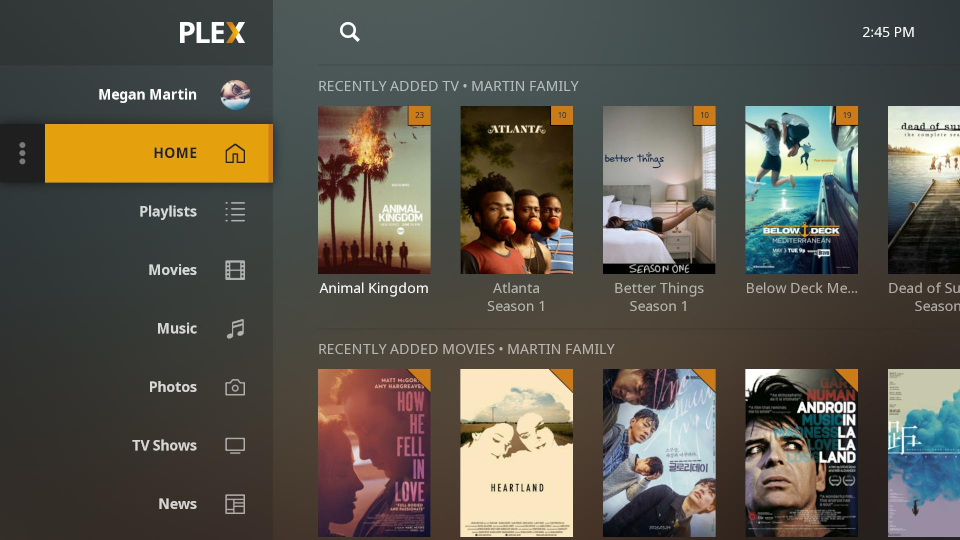

# home-media-server

This repo is a compilation of services that runs a media server that is able to automatically download and watch for TV Series and Movies. The services, listed below, are managed in containers run via docker and docker-compose.

## Initial Configuration Steps

To be done

## Services

### [Plex Media Server](https://www.plex.tv/)

Docker Image: https://hub.docker.com/r/linuxserver/plex/

Handles the work of serving media files to various player clients

### [Sonarr](https://sonarr.tv/)

Docker Image: https://hub.docker.com/r/linuxserver/sonarr/

Automatically searches for torrents for TV series, watches for new episodes

### [Radarr](https://radarr.video/)

Docker Image: https://hub.docker.com/r/linuxserver/radarr/

Automatically searches for torrents for Movies

### [Jackett](https://github.com/Jackett/Jackett)

Docker Image: https://hub.docker.com/r/linuxserver/jackett/

Proxy for various tracker sites. Takes queries from Sonarr/Radarr and translates them into tracker-site-specific queries and relays responses

### [Transmission](https://transmissionbt.com/)

Docker Image: https://hub.docker.com/r/linuxserver/transmission/

BitTorrent client with a web interface, handles downloads given by Sonarr/Radarr

### [Ombi](https://ombi.io/)

Docker Image: https://hub.docker.com/r/linuxserver/ombi

Bridges the gap between Radarr and Sonarr. Tools for allowing non-admin users to request movies

### [Tautulli](https://tautulli.com/)

Docker Image: https://hub.docker.com/r/linuxserver/tautulli

Displays stats about Docker Service

